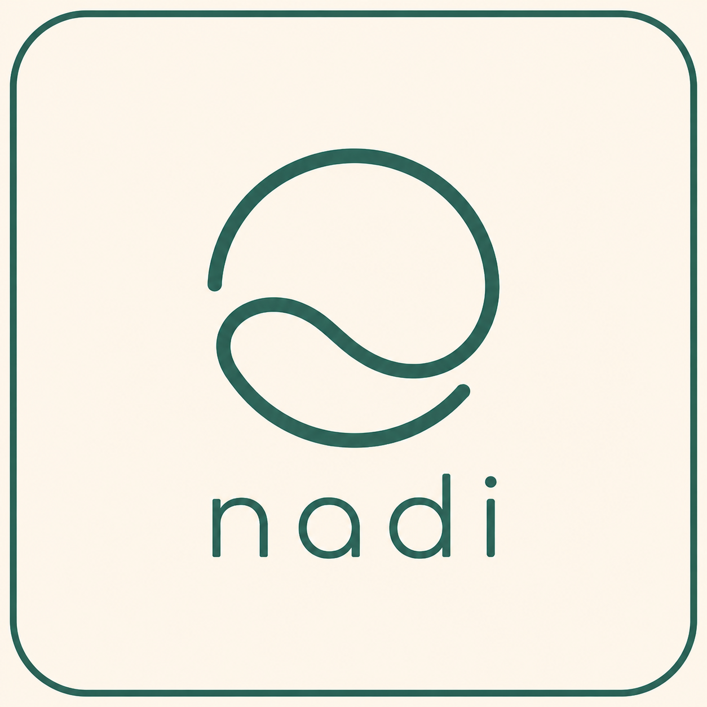

<p align="center">
  
</p>

# Nadi

> 記錄自己的生活訊號

<p align="center">
  <a href="#readme-zh">中文版</a>
</p>

Nadi is a personal life-signal tracking system. Users can define their own tracking items, record daily signals, and review summary and correlation reports over a chosen date range.

## Project Status

Nadi is currently an MVP built with Next.js, Drizzle ORM, and PostgreSQL.

Implemented today:

- Custom tracking items
- Daily record creation and timeline view
- Summary report API and UI
- Correlation report API and UI
- Local-first foundation with IndexedDB
- Foreground sync, device/account linking, and manual conflict resolution
- Data export (CSV / JSON / full backup), import validation, and backup recovery
- Ownership summary panel and export history

Still in progress or out of scope for now:

- Reliable background sync on mobile platforms
- Encrypted backup option
- Photo upload
- Production hardening beyond MVP scope

## Features

- Custom items for metrics or symptoms
- Multiple value types: number, boolean, scale, text
- Record history with timestamps and notes
- Summary reports for recent data review
- Correlation reports between symptoms and other records
- Archived items to preserve historical meaning
- Local-first write flow backed by IndexedDB
- Sync queue, device-link, and conflict resolution (keep local / keep cloud)
- CSV / JSON / full backup export with import validation and safe recovery
- Ownership panel for cloud data summary and export history

## Trade-offs

### Why not Microservices?

The current scale does not justify the operational complexity.

A modular monolith on Next.js + PostgreSQL is sufficient for the MVP.

### Why not reliable iOS background sync (yet)?

PWA background execution on iOS is limited and unpredictable.

Foreground sync keeps the first version simpler while still protecting local writes through IndexedDB and a retry queue.

### Why not auto-merge sync conflicts?

Automatic merges can silently overwrite meaningful personal records.

Conflicts are surfaced in the UI so the user explicitly chooses to keep the local or cloud version.

### Why not store full export payloads in the database?

`export_histories` keeps metadata only; the actual file is returned as a download.

This reduces storage cost, limits long-term retention of duplicate sensitive data, and keeps exports portable outside the platform.

### Why archive instead of hard delete?

Archived items and soft-deleted records preserve historical meaning for reports and sync tombstones.

Hard deletes would make past observations harder to interpret and riskier to sync across devices.

## Tech Stack

- Next.js App Router
- TypeScript
- React
- Tailwind CSS
- Drizzle ORM
- PostgreSQL / Neon Postgres
- Better Auth
- Vitest
- pnpm

## Screenshots

Branding asset:

<p>
  
</p>

UI screenshots are not documented in the repository yet.

## Quick Start

### 1. Install dependencies

```bash
pnpm install
```

### 2. Configure environment variables

Use `.envrc` for local secrets management. `.env.example` is documentation only and must not contain real credentials.

Recommended local variables:

```env
DATABASE_URL=
DIRECT_DATABASE_URL=
AUTH_SECRET=
AUTH_URL=http://localhost:3000

NADI_APP_MODE=local
NADI_DEBUG=false
NADI_ENABLE_OFFLINE_SYNC=false

NADI_REPORT_MAX_RANGE_DAYS=365
NADI_CORRELATION_DEFAULT_WINDOW_HOURS=24
NADI_CORRELATION_MIN_SAMPLE_SIZE=5
```

Recommended `.envrc` pattern:

```bash
source_env_if_exists ~/Secrets/Nadi/dev.env
```

### 3. Start the development app

```bash
pnpm dev
```

Open [http://localhost:3000](http://localhost:3000).

## Local Database

If you want a local PostgreSQL instance for development:

```bash
pnpm db:docker:up
pnpm db:migrate
pnpm db:seed
pnpm dev
```

See [docs/local-docker.md](docs/local-docker.md) for the full setup flow.

## Available Scripts

```bash
pnpm dev
pnpm build
pnpm start
pnpm lint
pnpm typecheck
pnpm test
pnpm test:unit
pnpm db:generate
pnpm db:migrate
pnpm db:seed
pnpm db:push
pnpm db:studio
```

## Repository Guide

- [docs/slides/](docs/slides/): system design slide deck (GitHub Pages)
- [docs/system-design.md](docs/system-design.md): product and system design overview
- [docs/architecture.md](docs/architecture.md): runtime architecture and local-first direction
- [docs/api-design.md](docs/api-design.md): API shape and contracts
- [docs/database-schema.md](docs/database-schema.md): database model notes
- [docs/roadmap.md](docs/roadmap.md): planned phases
- [docs/offline-sync-design.md](docs/offline-sync-design.md): offline/local-first sync design

---

<a id="readme-zh"></a>

# Nadi 中文版

> 記錄自己的生活訊號

Nadi 是一個個人 life-signal tracking system。使用者可以自訂追蹤項目、記錄日常訊號，並在指定時間區間內查看 summary reports 與 correlation reports。

## 專案狀態

Nadi 目前是以 Next.js、Drizzle ORM 與 PostgreSQL 建構中的 MVP。

目前已實作：

- 自訂 tracking items
- Daily records 建立與 timeline view
- Summary report API 與 UI
- Correlation report API 與 UI
- 以 IndexedDB 為基礎的 local-first foundation
- Foreground sync、device/account linking 與手動 conflict resolution
- 資料匯出（CSV / JSON / full backup）、匯入驗證與備份恢復
- Ownership 摘要面板與 export history

目前尚未完成或暫不在範圍內：

- 行動平台可靠的背景同步
- 加密備份選項
- Photo upload
- 超出 MVP 範圍的 production hardening

## 功能

- 可自訂 metric 或 symptom 類型的 items
- 支援 `number`、`boolean`、`scale`、`text` 多種 value type
- 可記錄帶時間戳與 note 的歷史資料
- 可查看 summary reports
- 可探索 symptom 與其他紀錄之間的 correlation reports
- 支援 archived items，保留歷史資料語意
- 以 IndexedDB 為基礎的 local-first 寫入流程
- Sync queue、device-link 與衝突解決（保留本機 / 保留雲端）
- CSV / JSON / 完整備份匯出，含匯入驗證與安全恢復
- Ownership 面板：雲端資料摘要與匯出紀錄

## 取捨

### 為什麼不用 Microservices？

目前規模不足以承擔額外的維運複雜度。

Next.js + PostgreSQL 的 modular monolith 已足夠支撐 MVP。

### 為什麼暫不做可靠的 iOS 背景同步？

iOS 上的 PWA 背景執行能力有限且不穩定。

先以 foreground sync 降低複雜度，同時仍透過 IndexedDB 與 retry queue 保護本機寫入。

### 為什麼不自動合併同步衝突？

自動合併可能默默覆蓋對使用者有意義的個人紀錄。

衝突會在 UI 中呈現，由使用者明確選擇保留本機或雲端版本。

### 為什麼不在資料庫保存完整匯出內容？

`export_histories` 只保存 metadata；實際檔案以下載形式提供。

這能降低儲存成本、減少長期重複保存敏感資料，也讓匯出檔更容易帶離平台。

### 為什麼用 archive 而不是 hard delete？

Archived items 與 soft-deleted records 能保留報表與 sync tombstone 所需的歷史語意。

Hard delete 會讓過往觀察更難解讀，也提高多裝置同步的風險。

## 技術棧

- Next.js App Router
- TypeScript
- React
- Tailwind CSS
- Drizzle ORM
- PostgreSQL / Neon Postgres
- Better Auth
- Vitest
- pnpm

## 快速開始

### 1. 安裝依賴

```bash
pnpm install
```

### 2. 設定環境變數

本機 secrets 建議透過 `.envrc` 管理。`.env.example` 只作說明用途，不應填入真實憑證。

建議的本機變數：

```env
DATABASE_URL=
DIRECT_DATABASE_URL=
AUTH_SECRET=
AUTH_URL=http://localhost:3000

NADI_APP_MODE=local
NADI_DEBUG=false
NADI_ENABLE_OFFLINE_SYNC=false

NADI_REPORT_MAX_RANGE_DAYS=365
NADI_CORRELATION_DEFAULT_WINDOW_HOURS=24
NADI_CORRELATION_MIN_SAMPLE_SIZE=5
```

建議的 `.envrc` 寫法：

```bash
source_env_if_exists ~/Secrets/Nadi/dev.env
```

### 3. 啟動開發環境

```bash
pnpm dev
```

開啟 [http://localhost:3000](http://localhost:3000)。

## 本機資料庫

若你要在本機啟動 PostgreSQL 開發環境：

```bash
pnpm db:docker:up
pnpm db:migrate
pnpm db:seed
pnpm dev
```

完整流程請看 [docs/local-docker.md](docs/local-docker.md)。

## 可用 Scripts

```bash
pnpm dev
pnpm build
pnpm start
pnpm lint
pnpm typecheck
pnpm test
pnpm test:unit
pnpm db:generate
pnpm db:migrate
pnpm db:seed
pnpm db:push
pnpm db:studio
```

## 文件導覽

- [docs/slides/](docs/slides/): system design 簡報（GitHub Pages）
- [docs/system-design.md](docs/system-design.md): 產品與系統設計概觀
- [docs/architecture.md](docs/architecture.md): runtime architecture 與 local-first 方向
- [docs/api-design.md](docs/api-design.md): API 介面與資料契約
- [docs/database-schema.md](docs/database-schema.md): database schema 說明
- [docs/roadmap.md](docs/roadmap.md): 開發階段規劃
- [docs/offline-sync-design.md](docs/offline-sync-design.md): offline/local-first sync 設計
